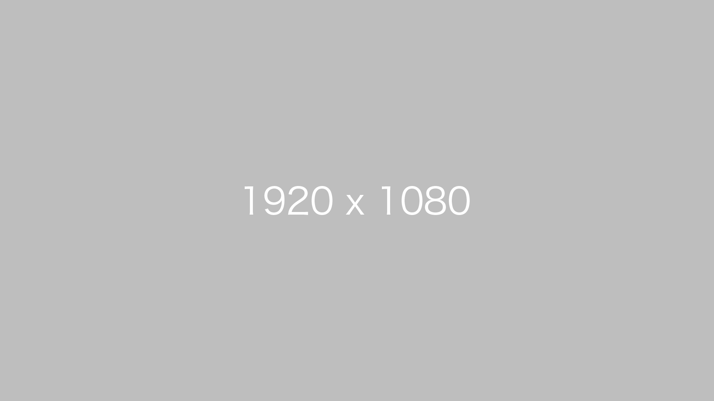
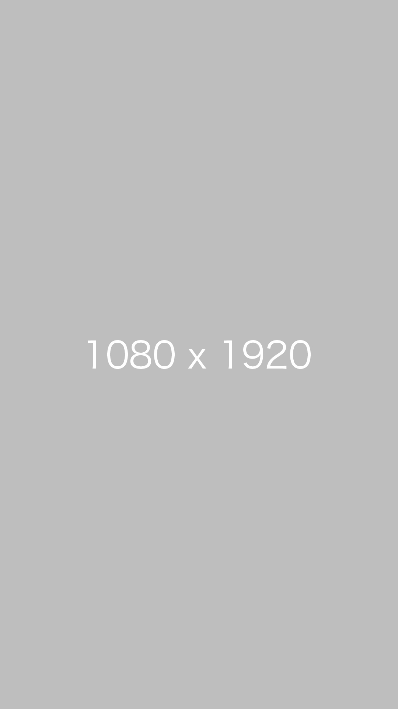

# notate.js

To adding class `.notatejs`, notate.js will judge "horizontal" or "vertical". And add the class automatically.

# Example

```html


```

exec `notatejs()`

```html


```

# Getting Started

Import the JavaScript file.

```html
<script src="notate.js" />
```

Add class to target element.

```html

```
